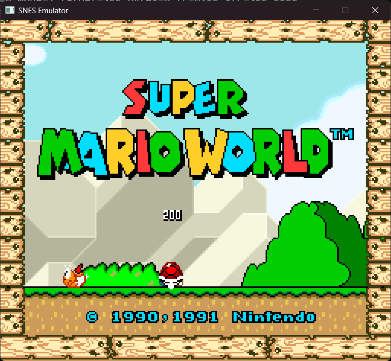

# snes

A SNES emulator written in C++.



[Cartridge compatibility and saves](docs/compatibility.md) covers supported board layouts, prototype header detection, battery saves, headless game checks, and remaining gaps.

Build and test from the repository directory with CMake, Ninja and a C++20 compiler:

```powershell
cmake --preset release
cmake --build --preset build-release
ctest --test-dir out/build/release --output-on-failure
```

Run a game on Windows:

```powershell
.\out\build\release\frontend\snes_frontend.exe "C:\path\to\game.sfc"
```

[Audio playback](docs/audio.md) explains buffering, frame pacing and audio regression tests.
[Rendering and LoROM checks](docs/accuracy-notes.md) covers coordinate handling, ROM mapping and their regression tests.
[Cartridge, PPU, and DMA regression checks](docs/hardware-regressions.md) covers DSP-1 addressing, ROM mirrors, counter latching, palette access, OAM, overscan timing, and indirect HDMA termination.
[CPU regression checks](docs/cpu-regressions.md) covers stop and wait states, interrupt entry, and stack boundaries.
[Cartridge devices and region timing](docs/cartridge-devices.md) covers DSP-2, OBC1, S-RTC, Sufami Turbo, cartridge saves, and PAL timing.
[Controllers and cartridge slots](docs/controllers-and-slots.md) covers mouse and multitap setup, host gamepads, BS slot boards and flash saves, and combined Sufami Turbo images.
[S-DD1, DMA timing, and video output](docs/dma-video-and-sdd1.md) covers decompression, expanded cartridge images, DMA stalls, high resolution, interlace, tests, and remaining hardware gaps.
[Source layout](docs/source-layout.md) describes the core subsystem folders.
