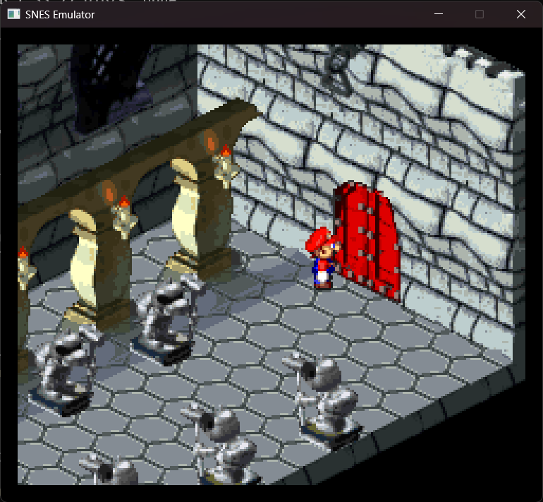

# snes

A C++20 SNES emulator with an SDL3 frontend and a core that can be used from tests and command-line tools. The project focuses on the console bus, cartridge hardware, audio, video timing, and the parts of the system that can be checked without a game running.




This is still a work in progress. A cartridge can load and pass focused hardware tests while games that use it may still need more work.

## What is implemented

The core includes:

- A 65816 CPU core connected to the SNES memory bus, interrupt lines, stack behavior, wait and stop states, and CPU I/O registers.
- A 24-bit bus with WRAM, open-bus behavior, PPU and APU ports, DMA and HDMA, controller polling, and master-clock timing.
- A scanline renderer with tiled backgrounds, sprites, windows, color math, Mode 7, high-resolution and pseudo-hires output, overscan, and interlace.
- An SPC700 and S-DSP audio path with BRR samples, envelopes, Gaussian interpolation, pitch modulation, noise, stereo mixing, and echo at 32 kHz.
- Cartridge header detection, 512-byte copier-header removal, interleaved HiROM normalization, LoROM and HiROM mirrors, extended layouts, SRAM, and fast-ROM access timing.
- Cartridge hardware for DSP-1, DSP-2, DSP-3, DSP-4, OBC1, S-RTC, S-DD1, SPC7110, SA-1, Super FX, Cx4, ST010, BS-X, and Sufami Turbo. ST011 and ST018 currently cover their implemented board protocols, not their internal processors.
- SDL input for gamepads, keyboard controls, mouse, multitap, Super Scope, Justifiers, and the MACS rifle.
- `.srm`, `.rtc`, and flash sidecar saves, written through temporary files before replacement.

The implementation details and validation boundaries are documented below. The [Original hardware support](docs/original-hardware.md) page is the best place to start for cartridge processor coverage and remaining gaps.

## Build

Build from the repository directory with CMake 3.21 or newer, Ninja, and a C++20 compiler. CMake uses an installed SDL3 when it finds one. Otherwise it fetches SDL3 release 3.2.8 and builds it as a static library, so the first configure may need network access.

The repository provides Debug and Release presets. The usual Release build and test commands are:

```powershell
cmake --preset release
cmake --build --preset build-release
ctest --test-dir out/build/release --output-on-failure
```

Use the `debug` preset and `out/build/debug` when you need an instrumented development build. If you configure a Windows build with Clang AddressSanitizer, keep the matching `clang_rt.asan_dynamic-x86_64.dll` on `PATH` or beside the executable. The sanitizer runtime is installed with LLVM; it is not part of the Release output.

## Run a game

The SDL frontend takes a ROM path. It accepts ordinary `.sfc` and `.smc` images, including images with a 512-byte copier header when the loader can identify the header.

```powershell
.\out\build\release\frontend\snes_frontend.exe "C:\path\to\game.sfc"
```

Both controller ports default to gamepads. The keyboard maps the arrow keys to the D-pad, Z/X to B/A, A/S to Y/X, Q/W to L/R, Enter to Start, and Right Shift to Select. Escape closes the window. Host gamepads are assigned in connection order.

Use `--port1=` or `--port2=` to select `pad`, `mouse`, `multitap`, or `none`. Port 2 also accepts `scope`, `justifier`, `justifiers`, and `rifle`. The same frontend can load separate Sufami Turbo files with `--sufami` or a BS cartridge and pack with `--broadcast`. Their file layouts and controller details are in [Controllers and cartridge slots](docs/controllers-and-slots.md), [Cartridge devices and region timing](docs/cartridge-devices.md), and [Light guns and raster memory](docs/light-guns-and-raster.md).

When a cartridge has battery RAM, the frontend looks for an `.srm` file beside the ROM. S-RTC and SPC7110 RTC state use `.rtc` files. Broadcast flash packs use a `.flash` sidecar. Changed saves are flushed every 300 frames and again when the frontend exits normally.

## Tests and tools

The CTest suite uses generated ROMs, small 65816 and coprocessor programs, command streams, known output vectors, and deterministic clocks. It covers CPU and interrupt behavior, bus scheduling, PPU rendering, DMA and HDMA, audio phases, controllers, cartridge mapping, saves, and the supported cartridge devices. The committed tests do not need commercial game files.

The build also includes two small command-line tools:

- `snes_rom_smoke` runs a ROM without opening a window, counts frames with nonblack pixels and non-silent audio samples, presses Start for a short scripted interval, and can save the last frame as a BMP.
- `snes_trace_dump` demonstrates a trace sink for CPU bus, PPU register, and DMA events.

The smoke tool's arguments and exit codes are documented in [Cartridge compatibility and saves](docs/compatibility.md). [Source layout](docs/source-layout.md) maps the core's folders to the hardware they contain.

## Current limits

The emulator is not cycle exact. CPU and coprocessor synchronization can finish a whole instruction, the renderer samples graphics state once per scanline, and several cartridge chips are modeled at the command or board-protocol level. BS-X live reception and SoundLink audio are not implemented. Light-gun input uses scheduled beam positions rather than modeling the optical sensor.

Passing a mapper test, recognizing a chip, or getting visible output from a smoke run is not the same as full game compatibility. The detailed notes call out the limits for each subsystem:

[Cartridge compatibility and saves](docs/compatibility.md) covers supported board layouts, prototype header detection, battery saves, headless game checks, and remaining gaps.

[Original hardware support](docs/original-hardware.md) covers cartridge processors and command engines, CPU and DMA bus timing, phased audio, differential checks, and the limits of the current implementations.

[Audio playback](docs/audio.md) explains buffering, frame pacing, and audio regression tests.

[Rendering and LoROM checks](docs/accuracy-notes.md) covers coordinate handling, ROM mapping, and their regression tests.

[Cartridge, PPU, and DMA regression checks](docs/hardware-regressions.md) covers DSP-1 addressing, ROM mirrors, counter latching, palette access, OAM, overscan timing, and indirect HDMA termination.

[CPU regression checks](docs/cpu-regressions.md) covers stop and wait states, interrupt entry, and stack boundaries.

[Cartridge devices and region timing](docs/cartridge-devices.md) covers DSP-2, OBC1, S-RTC, Sufami Turbo, cartridge saves, and PAL timing.

[Controllers and cartridge slots](docs/controllers-and-slots.md) covers mouse and multitap setup, host gamepads, BS slot boards and flash saves, and combined Sufami Turbo images.

[S-DD1, DMA timing, and video output](docs/dma-video-and-sdd1.md) covers decompression, expanded cartridge images, DMA stalls, high resolution, interlace, tests, and remaining hardware gaps.

[Light guns and raster memory](docs/light-guns-and-raster.md) covers Super Scope, Justifiers, MACS rifle, aiming controls, beam latches, and scanline memory snapshots.

[ST010 cartridge support](docs/st010.md) covers the board map, eight math commands, shared RAM, and validation limits.
